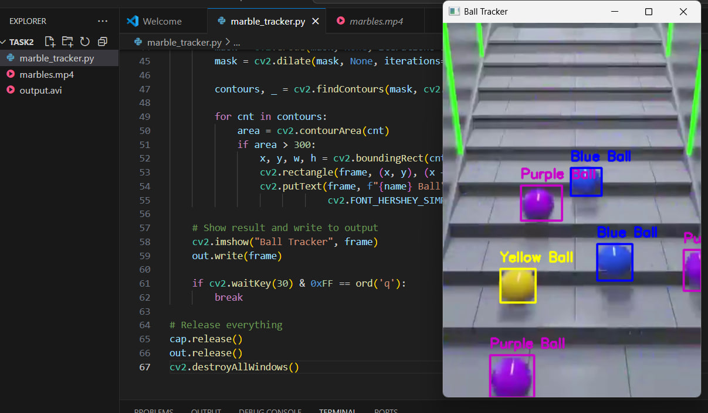

AI Task 2 – Color Ball Tracker using OpenCV

## 📝 Description
This project uses Python and OpenCV to detect and track multiple colored balls in a prerecorded video.  
Bounding boxes and labels are drawn on each detected object in real-time, and the processed video is saved as an output file.

---

## 📦 Features

- 🎯 Tracks 3 colors: 
Purple 🟣, Blue 🔵, Yellow 🟡
- 📁 Works on prerecorded video (no camera required)
- 🖼 Draws bounding boxes and labels on detected balls
- 💾 Saves the output as a new video file

---

## 🚀 How to Run

### 1️⃣ Requirements

- Python 3.10+
- OpenCV (opencv-python)
- NumPy (numpy)

> 📦 Install dependencies:
pip install opencv-python numpy

---

### 2️⃣ Project Files

| File              | Description                           |
|-------------------|---------------------------------------|
| marble_tracker.py | Main Python script                   |
| marbles.mp4       | Input video (must be in same folder) |
| output.avi        | Output video with tracking result     |

---

### 3️⃣ Usage

> ▶️ To run the tracker:

python marble_tracker.py

💡 Press Q to quit the video window anytime.

---

## 🎨 Color Detection Ranges (HSV)

| Color   | HSV Range                                |
|---------|-------------------------------------------|
| Purple 🟣 | [125, 50, 50] to [155, 255, 255]       |
| Blue 🔵   | [90, 100, 50] to [130, 255, 255]       |
| Yellow 🟡 | [20, 100, 100] to [30, 255, 255]       |

You can change or add more colors in the colors dictionary inside the script.

---

## 🎥 Output
 • The video is processed and saved as output.avi
 • Bounding boxes are drawn around detected colored balls
 • A screenshot of the result can be saved as result.png
